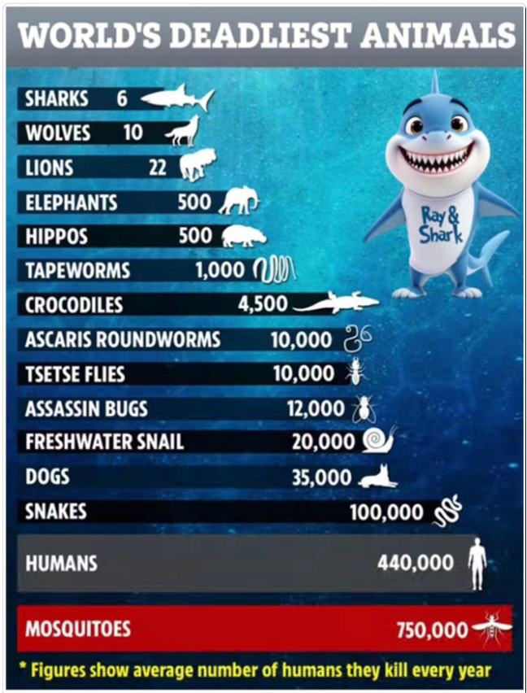
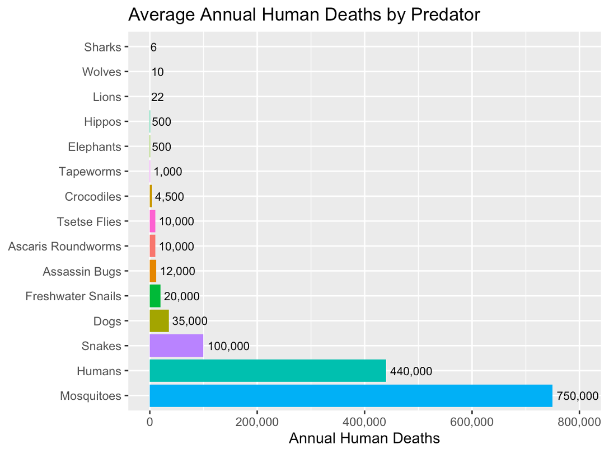
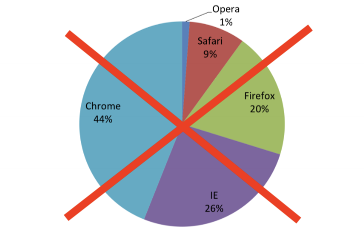
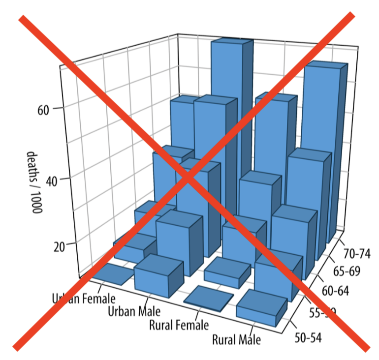



## Welcome!

#### Who am I?

-   My name is Grace
-   I'm a Biostatistician and Assistant Professor of Teaching (Dept. of Statistics) </br> </br>

#### Who is this workshop for?

-   If you're new(ish) to R or relatively experienced, you're in the right place!
-   This workshop will go at *your* pace - just keep in mind we only have an hour together

## Goals of this Workshop

By the end of this workshop, attendees should be able to:

-   Interact with data in R more confidently
-   Create plots using `ggplot2`

## How to Interact with R in This Workshop

-   These slides are built with Quarto + WebR, meaning you can code in them without downloading any software!

-   Your code *should* stay on the web address, but I recommend saving a PDF by \[right clicking\] -\> \[Print...\] -\> \[Save/Export to PDF\] :)

-   For your own research/projects, I highly recommend checking out how to use RStudio! [Here's a video on how to use RStudio.](https://www.youtube.com/watch?v=OYxDwybdlkY)

## Data Visualization: Why Do We Use It?

-   ❌ Tables are hard to digest.
-   ✅ Visualizations can convey more complex ideas faster
-   ✅ Visualizations can help us answer descriptive and exploratory questions
    -   ⚠️ They do not answer predictive, inferential, or causal questions

## Great Data Visualizations

| “A good visualization will clearly answer your question without distraction; a great visualization will suggest even what the question was itself without additional explanation.” - [*A First Introduction to Data Science*](https://datasciencebook.ca/viz.html)

</br>

How do we accomplish this? Keep this **SASS**-y

-   [S]{.underline}imple (plot is as simple as possible, minimizing distractions)

-   [A]{.underline}ccessible (colourblind-friendly pallettes are used, text is human-readable)

-   [S]{.underline}pecific (the purpose of the plot is clear, and explores a specific research question)

-   [S]{.underline}caled (small differences are not blown up, proportionality is maintained)

## Data Visualizations

Which principles of good data visualization are met/violated here?

{fig-align="center" width="600"}

## Data Visualizations

{fig-align="center"}

(Numbers based off previous image which is... questionably sourced :-) )

## Making Nice Plots in R

A crowd favourite package for plotting in R is `ggplot2` (which has the `ggplot()` function).\

There are three key aspects of plots in `ggplot2`:

1.  **aesthetic mappings:** relates dataframe columns to visual properties

2.  **geometric objects:** disctates how to display those visual properties (type of plot, for example)

3.  **scales:** transforms variables, sets limits


We add these layers one by one using `+`

</br>

::: {.callout-note}
## Important Note
Building plots is an iterative procedure. Try things, make mistakes, and refine!
:::

# Demo

## Today's Demo: Penguins! 

We will explore the `penguins` data set from the `palmerpenguins` package in R. 


```{webr}
# install the required package (first time only)
# install.packages(c("palmerpenguins", "ggplot2", "forcats")) 
#I've already installed it for you :)

# load in the required package to get access to the penguins dataset
library(palmerpenguins)
library(ggplot2)
library(forcats)

# look at the first few rows of the data with head()
head(penguins)
```

## Research Questions

An interesting research question may be how some of these measurements within a penguin are related. Let's investigate the following:

</br>

**Descriptive Visualizations**

- What species of penguins are in my data set? How many of each sex?

- What does the distribution of bill length measurements look like? 

**Exploratory Visualizations**

- Do penguins with longer bills also tend to have wider bills?

- Do certain species of penguin tend to have larger bills?


## Choosing a Data Visualization

Typically a data visualization is 2-Dimensional (think of drawing a plot on a piece of paper). We can easily visualize the relationship between two variables.

</br> 

**What plot should I use?**

- **Scatterplots**: used to visualize two quantitative (numeric) variables
- **Line plots**: used to visualize trends with respect to an independent quantity (like time)
- **Bar plots**: used to visualize the comparison of amounts (categorical variables). Can be stacked or grouped to show the relationships across another categorical variable. 
- **Box plot** or **histograms**: used to visualize distributions, perhaps across groups. 

## Choosing a Data Visualization: Counting Penguin Species

Let's visualize the types of penguins (species and sex) in our study. 

If we wanted to show the **counts** of each penguin species, which plot should we use?

</br>

. . . 

✅ A bar plot! We can plot this using `geom_bar()` in `ggplot`. 

## Bar Plot (`geom_bar()`)

Let's visualize how many penguins of each species we have in our data set

```{webr}


```


::: {.content-visible when-format="pdf"}
```
ggplot(penguins, aes(x = fct_infreq(species), fill = species)) + 
     geom_bar() + 
     ylab("Number of Penguins") + 
     xlab("Species") + 
     ggtitle("Number of Penguins by Species") + 
     coord_flip() + 
     geom_text(stat = "count", 
        aes(label = after_stat(count)), 
        hjust = -0.1)
```
:::


## Bar Plot (`geom_bar()`): Elevated!

Let's get the counts by sex, too!
 
```{webr}
ggplot(penguins, aes(x = fct_infreq(species), fill = species)) + 
     geom_bar() + 
     ylab("Number of Penguins") + 
     xlab("Species") + 
     ggtitle("Number of Penguins by Species") + 
     coord_flip() 
 
 
```
 
::: {.content-visible when-format="pdf"}
```
ggplot(penguins, aes(x = fct_infreq(species), fill = sex)) + 
     geom_bar(position = position_dodge(preserve = "single")) + 
     ylab("Number of Penguins") + 
     xlab("Species") + 
     ggtitle("Number of Penguins by Species") + 
     labs(fill = "Sex") +
     geom_text(stat = "count", 
               aes(label = after_stat(count)), 
               position = position_dodge(width = 0.9, preserve = "single"),
               hjust = -0.1) + 
     coord_flip()
```
:::

 
## Choosing a Data Visualization

Let's describe the distribution of the bill lengths in our data set. What visualization should we use?

. . .

✅ Histogram! (Or... a box plot)
 
 
 
## Histogram (`geom_hist()`) 


```{webr}


```


::: {.content-visible when-format="pdf"}
```
library(ggplot2)
library(palmerpenguins)

ggplot(penguins, aes(x = bill_length_mm)) +
  geom_histogram(binwidth = 1, fill = "steelblue", color = "white") +
  labs(
    title = "Distribution of Penguin Bill Lengths",
    x = "Bill Length (mm)",
    y = "Frequency"
  )
```
:::


 
## Choosing a Data Visualization

Let's visualize bill depth and bill width, which are measured in millimetres. 

</br>

What visualization should we use? 

. . .

✅ Scatterplot! We plot this using the `geom_point()` object within `ggplot`. 


## Scatterplot (`geom_point()`)

```{webr}
# Create a basic scatterplot using ggplot


```

::: {.content-visible when-format="pdf"}
```
ggplot(penguins, aes(x = bill_length_mm, y = bill_depth_mm)) + # call the 
  # ggplot function on the penguins data set, assign the bill length 
  # to the x axis, bill depth to the y axis
  geom_point() + # plot a scatterplot
  xlab("Bill Length (mm)") + # update the x axis label name
  ylab("Bill Depth (mm)") + # update the y axis label name
  ggtitle("Relationship between penguin bill lengths and depths") # add a title
```
:::


## Scatterplots: Grouping by a Categorical Variable

What about looking at this relationship between species? Do certain species of penguin tend to have larger bills?

. . .

</br>
We can group by colour/shape to see if there are trends within/between penguin species!


```{webr}
# Elevate the basic scatterplot to show species

ggplot(penguins, aes(x = bill_length_mm, y = bill_depth_mm)) + 
  geom_point() + # plot a scatterplot
  xlab("Bill Length (mm)") + # update the x axis label name
  ylab("Bill Depth (mm)") + # update the y axis label name
  ggtitle("Relationship between penguin bill lengths and depths") 

```

::: {.content-visible when-format="pdf"}
```
ggplot(penguins, aes(x = bill_length_mm, y = bill_depth_mm, 
                     col = species, shape = species)) + # call the 
  # ggplot function on the penguins data set, assign the bill length 
  # to the x axis, bill depth to the y axis. let species dictate the shape
  # and color of the point
  geom_point() + # plot a scatterplot
  xlab("Bill Length (mm)") + # update the x axis label name
  ylab("Bill Depth (mm)") + # update the y axis label name
  ggtitle("Relationship between penguin bill lengths and depths") + # add a title
  # update the title of the legend
 labs(color = "Species", shape = "Species")

```
:::


## Try it yourself: 

Are body mass and flipper lengths in penguins related? Does this vary by sex? 

```{webr}
# Show this relationship! 


```


::: {.content-visible when-format="pdf"}
```
ggplot(penguins, aes(x = flipper_length_mm, y = body_mass_g, col = sex)) + geom_point() +
  xlab("Flipper Length (mm)") + # update the x axis label name
  ylab("Body Mass (g)") + # update the y axis label name
  ggtitle("Relationship between penguin flipper length and body mass") +
  # update the title of the legend
 labs(color = "Sex", shape = "Sex")
```
:::


## Other Data Visualization Tips  {.noscroll .nostretch}

-   Avoid pie charts.

-   Avoid 3D visualizations

-   ..... Absolutely avoid 3D pie charts

::: {layout-ncol="2"}
{width="425"}

{width="300"}
:::


## Looking for more?

🛑 **Before you click any links, save your work as a pdf!**

[Right Click] -> [...Print] -> [Save/Export as PDF] (or right click to open links in a new tab)

</br>


- STAT545 Coursenotes on Data Visualization: <https://ubc-stat.github.io/stat545/webpages/lectures_i/lec4_datavis.html> (I teach STAT 545 A/B: Exploratory Data Analysis every fall, which is a data science-y course for non-statisticians)

- Jenny Bryan's "Dos and Don'ts of Making Effective Graphs": <https://stat545.com/effective-graphs.html> 

- R4DataScience Notes on Data Viz: <https://r4ds.had.co.nz/data-visualisation.html>

- LLMs like Claude, which are quite good at creating data visualizations. 

  -  ⚠️ NEVER upload private data to an LLM! ⚠️
  
- My YouTube channel [@proftompkins](https://www.youtube.com/@proftompkins) 
  
  
## Thank you!

Written materials from this presentation can be found [here](https://grcetmpk.github.io/lss2026-dataviz/notes.html): 

